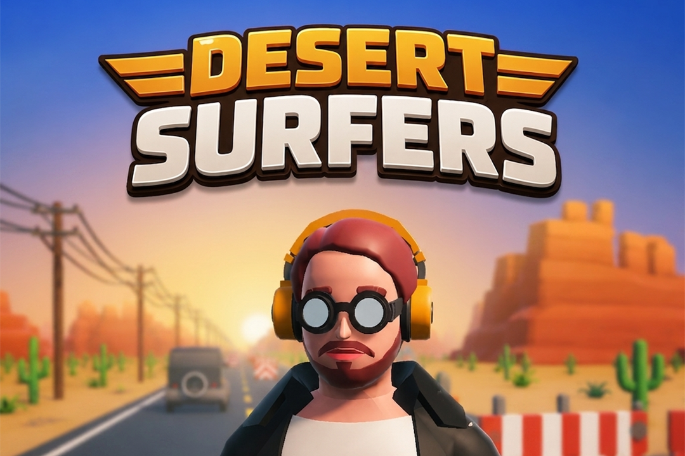
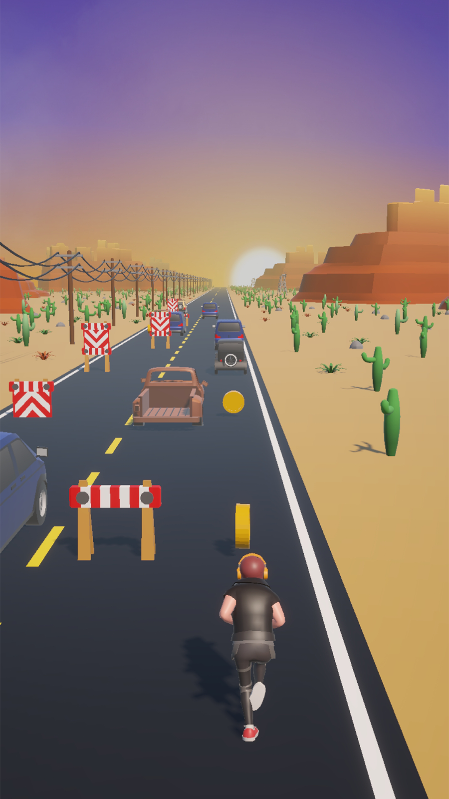
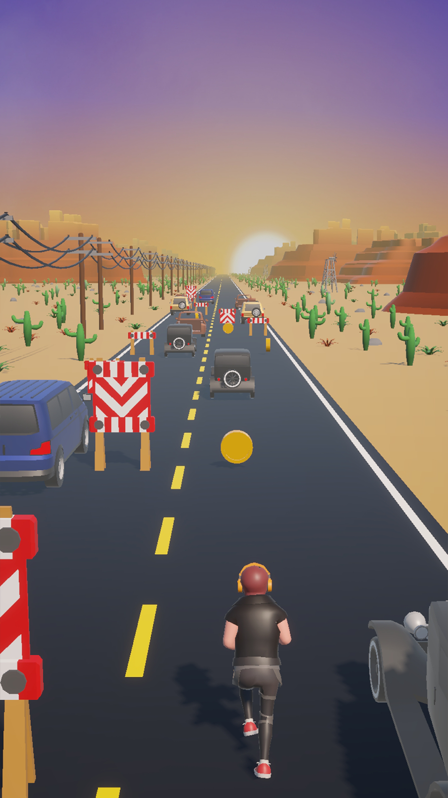
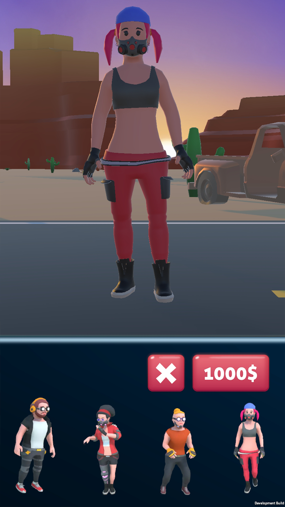
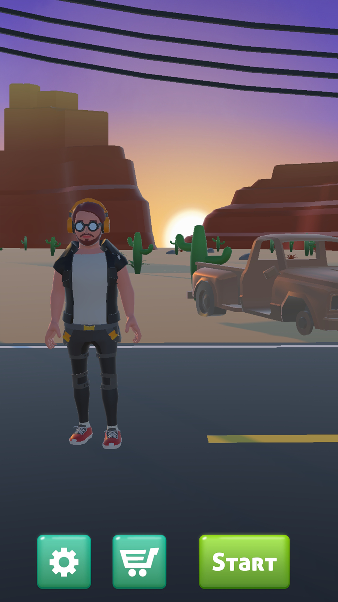

# Desert Surfers

## About

**Desert Surfers** is a 3D endless runner arcade game inspired by Subway Surfers, set in a hot and dangerous desert environment. Players control a desert surfer running at high speed across multiple lanes, dodging obstacles while collecting coins.

The game features a unique mechanic: holding your finger on the screen makes the character run **faster**. The player can change lanes, jump, and roll. The main obstacles are broken and abandoned cars scattered across the desert.

The game includes a coin collection system, an in-game Shop to unlock and play with different characters, and a high score / record system.

## Genre

Endless Runner

## Features

* Character Controller (Lane Change, Jump, Roll, Speed Boost by Holding)
* Dynamic Speed System (Hold to Run Faster)
* Desert Environment with Broken Cars as Obstacles
* Coin Collection & Shop System
* Multiple Unlockable Characters
* High Score / Record System
* Smooth 3D Gameplay
* Atmospheric Background

## My Role

Solo Developer (Unity Programmer)

## Technologies

* Unity
* C#
* Git

## Screenshots

  
  
  
  

## Gameplay Video

[Watch Gameplay Video](https://youtube.com/shorts/v0z0MzWKcyk?is=WyIBw-iyj4CgjA9L) 

## Challenges

One of the main challenges was implementing the precise control system with the hold-to-boost mechanic and synchronizing it with the player's State Machine.

## Status

Completed